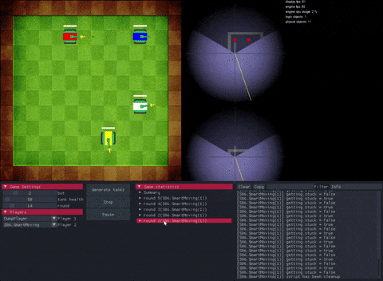
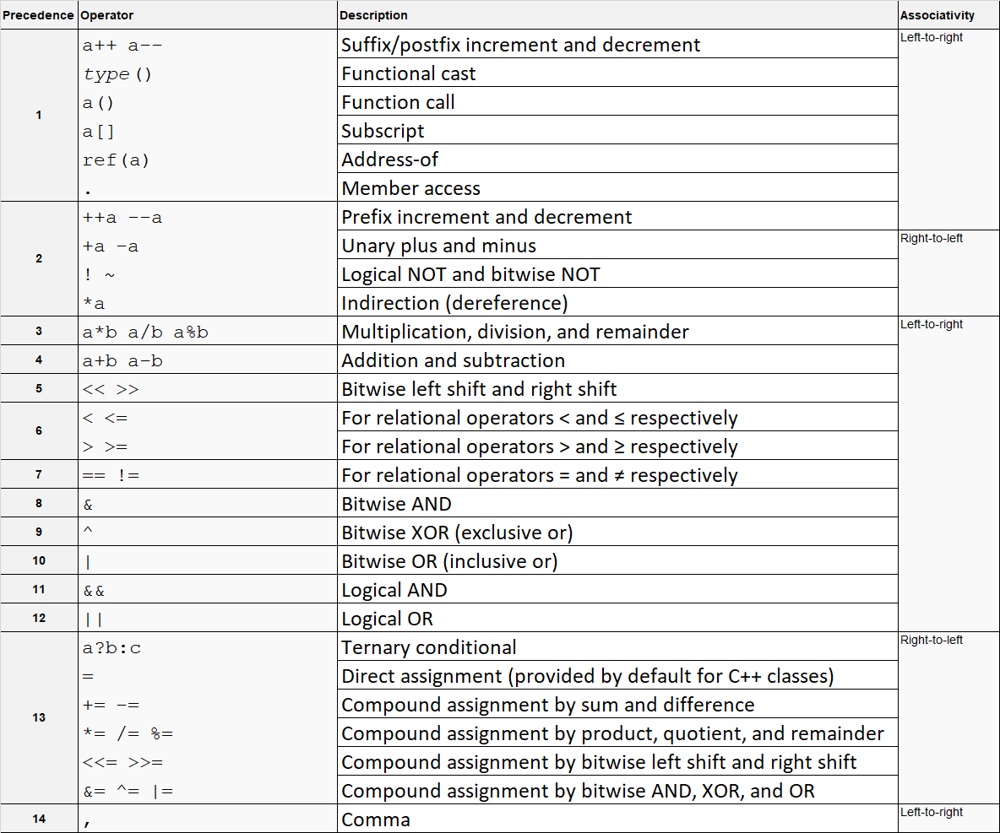

# ffscript
Introduce C Lambda(Cλ) scripting language, a scripting language makes C++ program even more flexible.
<p align="center"></p>

# What ffscript project does?
 The ffscript project builds a compiler and a framework that allow users compile and run the Cλ code inside a C++ host program.
 Currently, the project distributes as header files and two bellow static libraries:
* ffscript.lib - contains script compiler, script running engine and framework to embed the script language into a C++ program.
* ffscriptLibrary.lib - contains some built-in custom libraries such as Math library, Geometry library.

# What Cλ language is?
 C Lambda language or Cλ in short is a scripting language but it is not like other programming languages designed to work independently.  Working independently means the programming language itself can work with all or many specific domains such as IO operations, networking, databases, graphics.

 The Cλ language does not work like that. It is dependent on what your application offers. The Cλ only offers some very basic operations (defined in ffscript.lib) such as Addition, Subtraction, Multiplication, Division and some others operators like other programming languages do. It also has framework to allow user map functions, types in C++ side to script side.

 So, basically, this language is not designed to compete with other languages but supports for C/C++ language. Giving C/C++ program or library more power, more flexible.
 
# What can Cλ language do?
 Even though Cλ language library supplies very limited of buit-in operations, it can be easy extended by combining with C++. So, it is not exaggerated to say that its power is unlimited.
 
 Let's check the best practice of using Cλ language in [Tank Battle game](https://github.com/VincentPT/tank-battle)
 

# Why Cλ language?
* C Lambda language is a C++-style language. However, it offers some basic features of C++ not all such as constructor, destructor and especially is Lambda function. So, that's why it is called as C Lambda.
* The Cλ language framework and running engine use the same memory layout, calling convention as C and C++. So, there is no cost of marshaling data between its engine and C/C++ program and able to reuse C/C++ functions without wrapper them.
* Since Cλ language has C-style and base on C and C++, it is easy and quickly to learn Cλ language for C, C++ programmers.
* Cλ language library only offers core operations and work only with application specific domain. So, it is very light and suitable to use in a program which don't want its users to do something that is out of the program bound like a game, an education application or an platform in a programming competition.

# Introduce Cλ language.
Any Cλ program can be divided into two bellow parts:
1. C++ part.  
 This part has responsibility for
 * Importing Cλ static library.
 * Registering domain specific types, functions.
 * Compile the script.
 * Running the complied script.

2. Script part.  
 Write the script using supported operations from the library and the application specific domain.

Here is a summary of most common features are used in a Cλ program.
* __Register a function.__  
 use registerFunction function.
* __Register a type.__  
 use registerUserType method.
* __Register an operator.__  
 use registerOperator function.
 * __Map a constant.__  
 use setConstantMap function.
* __Register a contructor.__  
 use registerContructor function.
* __Register a destructor.__  
 use registerDestructor function.
* __Register a dynamic function.__  
 use registerDynamicFunction function.
* __Using Lambda function.__  
  ```
  int val = 0;
  // defined lambda function and store function address to a function object
  f = [val](int x){
      // do some thing
  };
  // call a lambda function through the function object.
  f(0);
  ```
 
__Continue read bellow sections and check the [tutorials](tutorials/) to explore more.__

## Buit-in types.
C Lambda library provides primitive types inside the core. Some very basics operators and functions are built base on these types.
Here is mapping type table of all buit-in types in the library.

Cλ | C++
---|-----
void | void
int | int, unsigned int
bool | bool
char | char, unsigned char
wchar | wchar_t, short, unsigned short
float | float
double | double
long | long long, unsigned long long
constant string of char(1) | std::string
constant string of wchar(2) | std::wstring

(1): the string inside double quote. Example "this is a string".  
(2): the string inside double quote, right after character 'L'. Example L"this is a wstring".  
both types are just supported in read-only functions only. In case you want to modified a string, you must use 'String' type by import the RawString library in ffscriptLibrary.lib. (For more details check the [tutorials](tutorials/))

## Functions.
A function written inside a script can be a mapped function from C++ or a script function itself.
### Mapping a C++ function.
For function println is defined in C++ as bellow:
```
// C++ part
void println(const std::string& rs) {
 // do something
}
```
We can map the function to use it inside the script as bellow:
```
// C++ part
registerFunction<void, const std::string&>(fb, println, "println", "void","string&");
```
### Using it in the script.
```
// C lambda part
void doSomething() {
    // call a native C++ function
    println("Hello world!");
}
void main() {
    // call another script function
    doSomething();
}
```
## Operators  
  Support almost of C++ operators.
  
  Cλ operator precedence (based on https://en.cppreference.com/w/cpp/language/operator_precedence).
### Register a operator for a exist type.
```
// C++ part
// function register helper object
FunctionRegisterHelper fb(scriptCompiler);
// register operator<< of ostream and std::string
registerOperator<ostream&, ostream&, const string&>(fb, operator<<, "<<", "ostream", "ostream,string&");
```
### Using in the script.
```
// C Lambda part
// cout is an instance of ostream, which is already defined.
cout << "this is a sample string;
```
### Constructor/Destructor
 Registering constructor and destructor for a type is currently supported in C++ part only.
 For an existing type, constructor and destructor should be implemented like this.
 ```
 // C++ part
 // a constructor of 'SomeType' type.
 void __constructor(SomeType* obj, int a, float b) {
     // do something to initialize the object
 }
  // a destructor of 'SomeType' type.
 void __destructor(SomeType* obj) {
     // do something to uninitialize the object
 }
 ```
 Now, map it to the script like this.
 ```
 // C++ part
 registerContructor<SomeType*>(fb, __constructor, someTypeTypeId, "ref CustomArray");
 ```
 Then using it it the script like this.
 ```
 // C Lambda part.
 void main() {
    // constructor of SomeType will be executed here to construct object 'a'.
    SomeType a = {1, 2.0f};
    
    // before exit this scope object 'a' will be destroyed by destructor of SomeType.
}
 ```
### Dynamic functions.
Dynamic function is a short term of Dynamic parameters function. Like Constructor and destructor, the library only supports to register dynamic function in C++ part now. Here is the way to register and use it.  
First, you must define the function in C++ part.
 ```
 // C++ part
 // define a sum function which compute sum of numbers.
 double sum(SimpleVariantArray* params) {
    double sum = 0;
    for (int i = 0; i < params->size; i++) {
        auto& param = params->elems[i];
        if (strcmp(param.typeName, "int") == 0) {
            sum += (double)*(int*)param.pData;
        }
        else if (strcmp(param.typeName, "float") == 0) {
            sum += (double)*(float*)param.pData;
        }
        else if (strcmp(param.typeName, "double") == 0) {
            sum += (double)*(double*)param.pData;
        }
        else if (strcmp(param.typeName, "long") == 0) {
            sum += (double)*(long long*)param.pData;
        }
        else {
            throw std::runtime_error("argument must be a number");
        }
    }
    return sum;
 }
 ```
 Second, register it at the script compiler.
 ```
 // C++ part
 registerDynamicFunction<double>(fb, sum, "sum", "double");
 ```
 Then use it in the script.
 ```
 void main() {    
    double val = sum(0, 1.1f, 2.2, 3l);
    println("sum(0, 1.1f, 2.2, 3l) = " + val);
 }
 ```

# Licensing.
The project is distributed under MIT license.
For more details, check LICENSE file.
